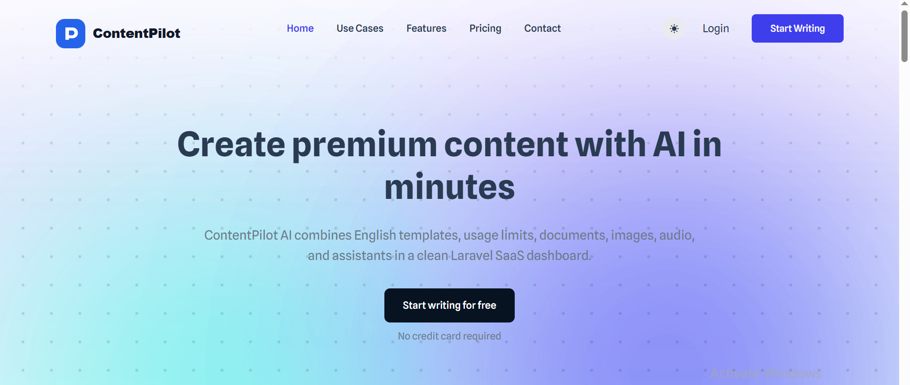
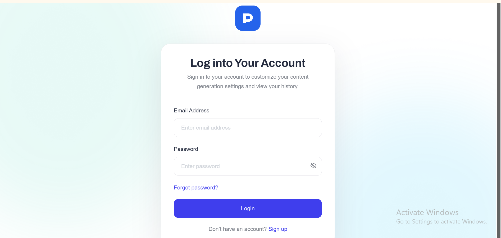
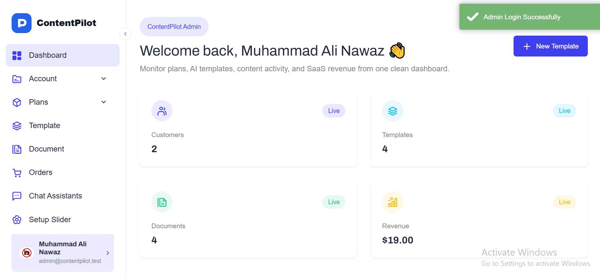
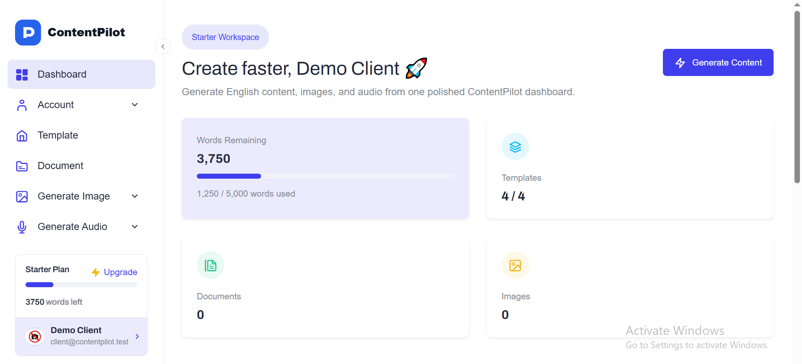
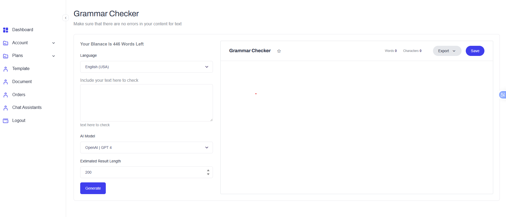
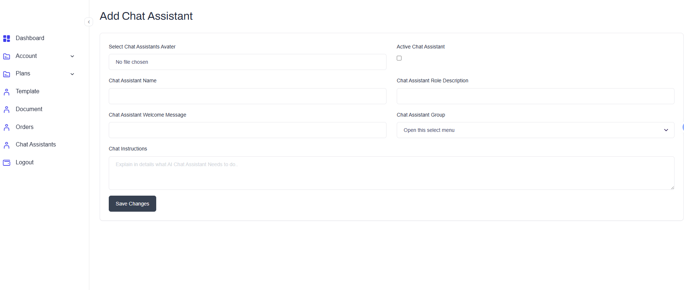

<h1 align="center">🤖 ContentPilot</h1>

<p align="center">
  <b>A Laravel-based AI Content SaaS Platform with admin/client dashboards, AI content templates, document history, media generation pages, plans, invoices, and usage tracking.</b>
</p>

<p align="center">
  
  
  
  
  
  
  
</p>

<p align="center">
  <b>AI Templates</b> •
  <b>Admin Dashboard</b> •
  <b>Client Dashboard</b> •
  <b>Plans & Invoices</b> •
  <b>Generated Documents</b>
</p>

---

## 📸 Project Screenshots


| Frontend / Home Page | Login Page |
|---|---|
|  |  |

| Admin Dashboard | User Dashboard |
|---|---|
|  |  |

| AI Content Generation | Chat Assistants |
|---|---|
|  |  |

| Image Generation | Audio Generation |
|---|---|
|  |  |

## 🚀 Project Overview

**ContentPilot** is a full-stack Laravel AI content platform designed for generating, managing, and organizing English-only AI content through a clean SaaS-style dashboard.

The project includes separate dashboard experiences for **Admin**, **Creator**, and **Client** users. Admins can manage plans, templates, orders, assistants, contacts, and generated content, while clients can generate content from templates, manage documents, access media generation pages, view billing details, and update their profile.

This project demonstrates practical Laravel development skills including dashboard architecture, authentication, database seeders, SaaS-style modules, plan-based usage tracking, template-based content generation, OpenAI-ready service structure, and responsive UI development.

---

## 🎯 Project Purpose

Modern creators, freelancers, marketers, and businesses need fast, structured, and reusable content generation tools. Many AI tools are either too generic or lack organized dashboard workflows.

**ContentPilot** solves this by providing a Laravel-based AI content platform where users can:

- Generate English-only AI content
- Use predefined content templates
- Save generated documents
- Manage usage limits
- View billing and invoice data
- Access image and audio generation pages
- Work inside a clean client dashboard
- Manage SaaS data from an admin panel

---

## 🎯 Key Highlights

- 🤖 Laravel-based AI content SaaS platform
- ✍️ English-only AI content generation
- 🧩 Template-based generation workflow
- 🧑‍💼 Admin dashboard for platform management
- 👤 Client dashboard for content generation and documents
- 📄 Generated document history
- 🖼️ Image generation page structure
- 🎧 Audio generation page structure
- 💳 Plans, orders, billing, and invoice modules
- 📊 Plan-based word usage tracking
- 📬 Contact management
- 🧠 OpenAI-ready generation services
- 📱 Responsive login, registration, sidebar, and dashboard layouts
- 🗄️ Demo users and seed data included

---

## ✨ Features

### 👤 Client Features

| Feature | Description |
|---|---|
| Authentication | Clients can register, login, and access their dashboard |
| AI Templates | Browse and use available content generation templates |
| Content Generation | Generate English-only AI content from selected templates |
| Documents | View and manage previously generated content |
| Image Page | Access image generation interface/page |
| Audio Page | Access audio generation interface/page |
| Billing | View plan, billing, and invoice-related pages |
| Profile Management | Update account and profile information |
| Usage Tracking | Track word usage based on assigned plan limits |
| Responsive Dashboard | Sidebar and top navigation optimized for different screen sizes |

---

### 🧑‍💼 Admin Features

| Feature | Description |
|---|---|
| Dashboard | View platform overview and management areas |
| Plan Management | Manage SaaS plans and usage limits |
| Template Management | Create and manage AI content templates |
| Order Management | Track user/client orders |
| Invoice Management | Manage billing and invoice records |
| Assistant Management | Manage AI assistant-related data |
| Contact Management | View and manage contact messages |
| Generated Content | Review generated content records |
| User Management | Manage demo users and platform accounts |
| Seed Data | Includes ready-to-test demo users and sample data |

---

### 🤖 AI Content Features

| Feature | Description |
|---|---|
| English-Only Generation | Focused on English content output |
| Template-Based Prompts | Users generate content through structured templates |
| OpenAI-Ready Services | Built to connect with OpenAI generation workflows |
| Generated History | Stores generated documents for later access |
| Word Usage | Tracks generated word usage against plan limits |
| SaaS Workflow | Supports plan-based content generation logic |

---

## 🧑‍💼 User Roles

| Role | Access Level |
|---|---|
| 👑 Admin | Platform management, plans, templates, orders, assistants, contacts, and generated content |
| ✍️ Creator | Content-focused account for testing creator workflows |
| 👤 Client | Content generation, documents, billing, media pages, and profile management |

---

## 🛠 Tech Stack

| Layer | Technologies |
|---|---|
| Backend | Laravel 12, PHP 8.2+ |
| Database | MySQL / MariaDB |
| Frontend | Blade, Bootstrap-based dashboard theme |
| Assets | Vite, Tailwind assets |
| AI Integration | OpenAI Laravel package |
| Authentication | Laravel authentication flow |
| Package Management | Composer, NPM |
| Local Environment | XAMPP, Laragon, WAMP, or Laravel local server |

---

## 🏗 Architecture Overview

ContentPilot follows Laravel's MVC architecture with organized routes, controllers, models, migrations, seeders, Blade views, dashboard layouts, and service-based AI generation structure.

```text
contentpilot-ai-saas/
├── app/
│   ├── Http/
│   │   ├── Controllers/
│   │   ├── Middleware/
│   │   └── Requests/
│   ├── Models/
│   ├── Services/
│   └── Providers/
├── bootstrap/
├── config/
├── database/
│   ├── factories/
│   ├── migrations/
│   └── seeders/
├── public/
├── resources/
│   ├── css/
│   ├── js/
│   └── views/
├── routes/
├── storage/
├── tests/
├── .env.example
├── artisan
├── composer.json
├── package.json
└── README.md
```

---

## 🔄 Application Flow

### Client Content Generation Flow

```text
Client Login
        ↓
Open Client Dashboard
        ↓
Choose AI Template
        ↓
Enter Required Inputs
        ↓
Generate English Content
        ↓
Save Generated Document
        ↓
Track Word Usage
```

### Admin Management Flow

```text
Admin Login
        ↓
Open Admin Dashboard
        ↓
Manage Plans / Templates / Orders
        ↓
Review Generated Content
        ↓
Manage Contacts and Assistants
        ↓
Monitor Platform Data
```

### Billing Flow

```text
Client Account
        ↓
Plan Assignment
        ↓
Word Usage Tracking
        ↓
Billing / Invoice Page
        ↓
Invoice Record Management
```

---

## 🗄 Database Overview

The system uses a MySQL database managed through Laravel migrations and seeders.

### Main Data Areas

| Data Area | Purpose |
|---|---|
| Users | Stores admin, creator, and client accounts |
| Plans | Stores SaaS subscription or usage plans |
| Templates | Stores AI content generation templates |
| Generated Documents | Stores generated AI content history |
| Orders | Stores plan/order-related records |
| Invoices | Stores billing and invoice-related records |
| Assistants | Stores AI assistant-related data |
| Contacts | Stores contact form or inquiry messages |
| Usage Records | Tracks word usage and generation limits |

---

## 🔐 Security Implementations

| Security Area | Implementation |
|---|---|
| Authentication | Login and registration flow for users |
| Password Security | Passwords are hashed using Laravel's hashing system |
| Protected Dashboards | Dashboard pages are protected from unauthorized users |
| Environment Security | API keys and credentials are stored inside `.env` |
| CSRF Protection | Laravel includes CSRF protection for forms |
| Validation | Laravel validation can protect form inputs |
| Database Security | Uses Laravel migrations and model-based data handling |
| Demo Data | Seeders provide safe local testing accounts |

> Recommended production improvements: enable HTTPS, disable debug mode, configure production mail, protect OpenAI API keys, add rate limits for AI generation, add payment gateway validation, and review all admin permissions before deployment.

---

## ⚡ Performance & Code Quality

- Uses Laravel MVC structure for maintainable development
- Uses Blade views for reusable frontend layouts
- Uses migrations and seeders for repeatable database setup
- Uses service-style AI generation structure
- Uses Bootstrap-based dashboard UI for clean admin/client screens
- Uses Vite for frontend asset handling
- Keeps sensitive keys and credentials inside `.env`
- Provides demo seed data for faster testing
- Organizes SaaS modules such as plans, templates, documents, invoices, and orders

---

## 📡 Routes / System Areas

| Area | Purpose |
|---|---|
| `/` | Home or landing page |
| `/login` | User login |
| `/register` | User registration |
| Admin Dashboard | Platform management area |
| Client Dashboard | Client content generation and account area |
| Templates | AI template browsing and generation |
| Documents | Generated document history |
| Images | Image generation page |
| Audio | Audio generation page |
| Billing | Billing and invoice area |
| Profile | Client profile management |
| Contacts | Contact/inquiry management |

> Actual route names may vary depending on your final route configuration.

---

## ⚙️ Installation Guide

### Requirements

- PHP 8.2 or higher
- Composer
- Node.js and NPM
- MySQL / MariaDB
- XAMPP, WAMP, Laragon, or similar local environment
- phpMyAdmin recommended
- Git
- OpenAI API key, if AI generation is enabled

---

### 1️⃣ Clone the Repository

```bash
git clone https://github.com/CodeByMan/contentpilot-ai-saas.git
cd contentpilot-ai-saas
```

---

### 2️⃣ Install PHP Dependencies

```bash
composer install
```

---

### 3️⃣ Install Frontend Dependencies

```bash
npm install
```

---

### 4️⃣ Create Environment File

For Windows:

```bash
copy .env.example .env
```

For macOS/Linux:

```bash
cp .env.example .env
```

---

### 5️⃣ Generate Application Key

```bash
php artisan key:generate
```

---

### 6️⃣ Configure Database

Create a new MySQL database:

```sql
CREATE DATABASE contentpilot_ai_saas;
```

Update your `.env` file:

```env
DB_DATABASE=contentpilot_ai_saas
DB_USERNAME=root
DB_PASSWORD=
```

Update the database username and password according to your local MySQL setup.

---

### 7️⃣ Configure OpenAI

Add your OpenAI API key inside `.env`:

```env
OPENAI_API_KEY=your_openai_api_key_here
```

If the project uses a different OpenAI environment variable name, use the one defined in your config or service file.

---

### 8️⃣ Run Migrations and Seeders

```bash
php artisan migrate:fresh --seed
```

---

### 9️⃣ Link Storage

```bash
php artisan storage:link
```

---

### 🔟 Start the Laravel Server

```bash
php artisan serve
```

---

### 1️⃣1️⃣ Start Vite Development Server

Open another terminal and run:

```bash
npm run dev
```

Now open the project in your browser:

```text
http://127.0.0.1:8000
```

---

## 🏗 Build for Production

To compile frontend assets for production:

```bash
npm run build
```

For production deployment, also configure:

```env
APP_ENV=production
APP_DEBUG=false
```

---

## 🔑 Demo Credentials

All demo accounts use this password:

```text
password
```

| Role | Email |
|---|---|
| 👑 Admin | `admin@contentpilot.test` |
| ✍️ Creator | `creator@contentpilot.test` |
| 👤 Client | `client@contentpilot.test` |

> Demo credentials are for local testing only. Change them before deploying the project.

---

## 📁 Important Folder Structure

```text
app/
├── Http/
│   ├── Controllers/
│   ├── Middleware/
│   └── Requests/
├── Models/
├── Services/
└── Providers/

database/
├── migrations/
└── seeders/

resources/
├── css/
├── js/
└── views/

routes/
├── web.php
└── auth.php

public/
storage/
tests/
```

---

## 🧪 Testing Checklist

- [ ] Install Composer dependencies
- [ ] Install NPM dependencies
- [ ] Create `.env` file
- [ ] Generate application key
- [ ] Create MySQL database
- [ ] Configure OpenAI API key
- [ ] Run migrations and seeders
- [ ] Start Laravel development server
- [ ] Start Vite development server
- [ ] Login as Admin
- [ ] Login as Creator
- [ ] Login as Client
- [ ] Open admin dashboard
- [ ] Open client dashboard
- [ ] Test template listing
- [ ] Test AI content generation
- [ ] Confirm generated document is saved
- [ ] Test document history page
- [ ] Test image generation page
- [ ] Test audio generation page
- [ ] Test plans page
- [ ] Test invoice/billing page
- [ ] Test profile page
- [ ] Test responsive sidebar on mobile
- [ ] Run production asset build

---

## ✅ Recruiter Highlights

This project demonstrates practical full-stack Laravel development skills, including:

- ✅ Laravel MVC architecture
- ✅ SaaS-style application structure
- ✅ Admin and client dashboard workflows
- ✅ AI content generation workflow
- ✅ OpenAI-ready service integration
- ✅ Template-based content generation
- ✅ Generated document history
- ✅ Plan-based usage tracking
- ✅ Billing and invoice module structure
- ✅ MySQL database design
- ✅ Laravel migrations and seeders
- ✅ Blade templating
- ✅ Bootstrap-based dashboard UI
- ✅ Vite asset compilation
- ✅ Environment-based configuration
- ✅ Responsive dashboard layout
- ✅ Portfolio-ready documentation

---

## 🚀 Future Improvements

- 📊 Advanced usage analytics
- 💳 Stripe or Paddle payment integration
- 📄 PDF invoice generation
- 🧾 Downloadable generated documents
- 🌐 REST API support
- 🔔 Real-time notifications
- 🧠 More AI assistant workflows
- 🖼️ Full image generation API integration
- 🎧 Full audio generation API integration
- 📥 Export generated content
- 🗂️ Folder-based document organization
- 🧪 Automated feature tests
- 🐳 Docker setup
- 📈 Admin analytics dashboard
- 👥 Team workspace support
- 🔐 Advanced role and permission management

---

## 🔒 Security Notes

Before pushing this project to GitHub, make sure these files and folders are not committed:

```text
.env
/vendor
/node_modules
/storage/*.key
```

Your `.env` file may contain sensitive information such as database credentials and API keys.

Use `.env.example` for public environment configuration examples.

Recommended production settings:

```env
APP_ENV=production
APP_DEBUG=false
```
---

## 👨‍💻 Author

**Muhammad Ali Nawaz**  
Full-Stack PHP / Laravel Developer

---

## 📄 License

This project is provided for portfolio and learning purposes.

---

<p align="center">
  <b>⭐ If you like this project, consider starring the repository!</b>
</p>

